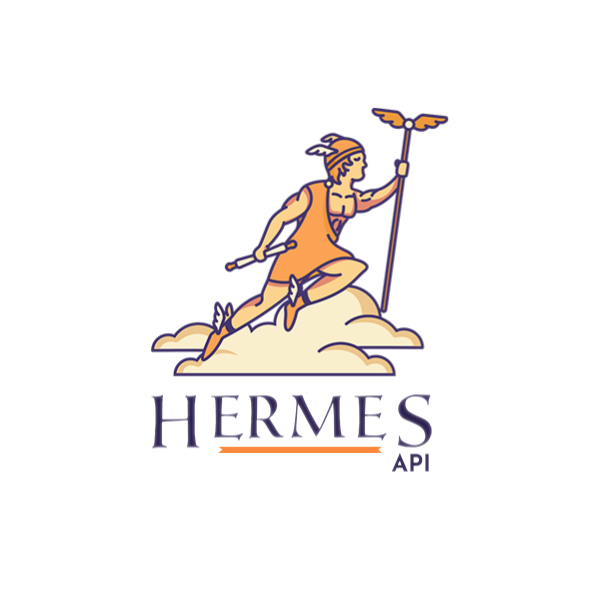
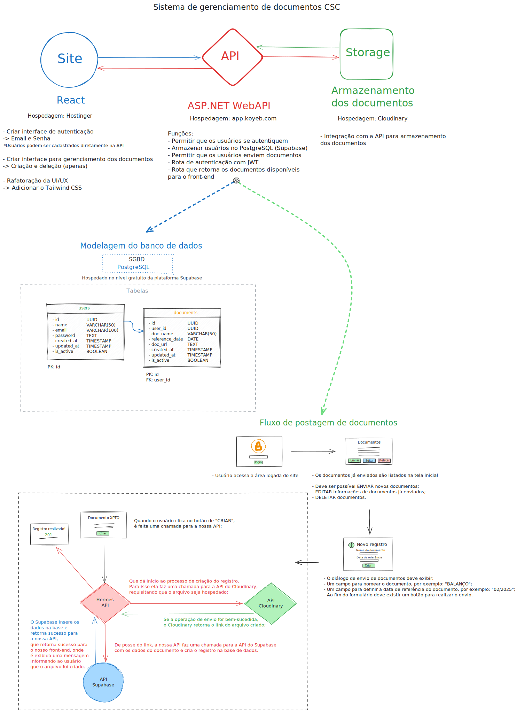

# HermesAPI

API que serve o sistema gerenciamento de documentos do portal da transparência da Casa São Camilo de Lelis

## Sobre o projeto

Este é um projeto desenvolvido pelos alunos, do curso de Análise e Desenvolvimento de Sistemas, Mathews Baio, Renan Guedes, Samuel Costa e William Bruno para a disciplina de extensão PIEX, e é uma colaboração entre o Instituto Vianna Júnior e a Casa São Camilo de Lelis (de Juiz de Fora - MG).

### Objetivo

> A intenção desta API é permitir acesso e gerenciamento na área logada do site da Casa São Camilo de Lelis, na qual os usuários autorizados podem postar as documentações referentes à prestação de contas da instituição, que ficarão disponíveis para consulta pública diretamente no site.

## Esboço da arquitetura da API

- Este é apenas um planejamento, os serviços utilizados podem ser alterados no momento da implementação a depender das demandas.

<https://excalidraw.com/#json=W-lCQ6JAa8Kl1XUXGnswg,oxk1AWWp-Huxk46VPL4q5w>

## Documentação da API

> Em desenvolvimento.

## Contato

- Para tratar deste projeto:

  <camilodelellisjf@gmail.com>

  <william.silva@viannasempre.com.br>

  <renan.brega@viannasempre.com.br>

  <mathews.baio@viannasempre.com.br>

  <samuel.costa@viannasempre.com.br>
